# 🖥️ Windows Customization Dotfiles

> A collection of desktop customizations, dotfiles, PowerShell utilities, themes, and workflow enhancements that shape my daily Windows setup.

Designed around a keyboard-first workflow with consistent aesthetics, reusable scripts, and lightweight tools that make Windows feel cohesive.

<p align="center">
  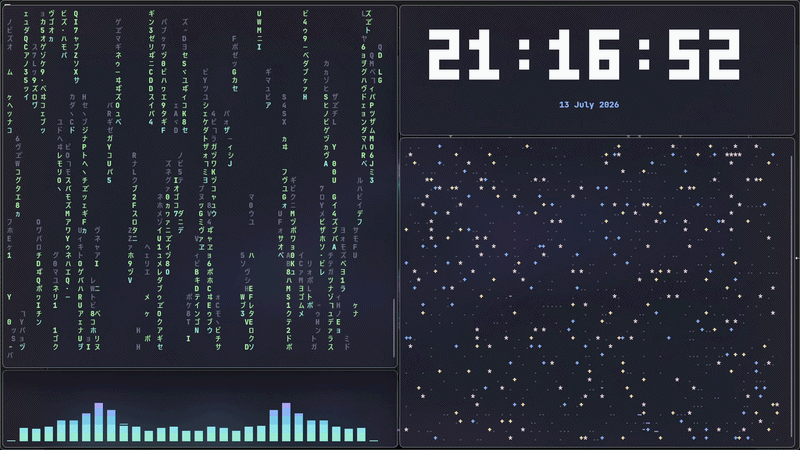
</p>

---

# Gallery

## Workspace

<p align="center">
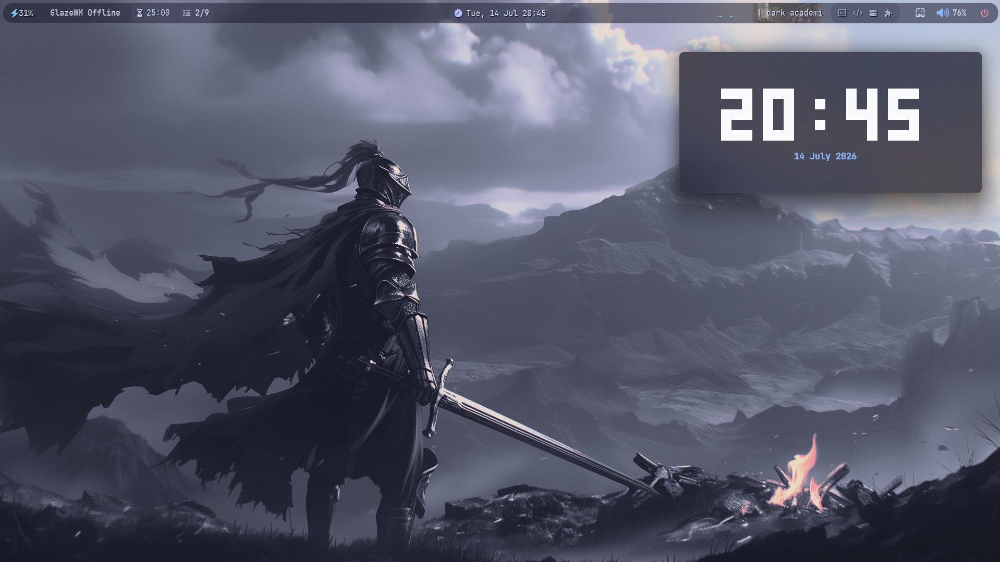
</p>

A clean desktop built around keyboard navigation, subtle transparency, and consistent styling.

---

## Everyday Workflow

| Desktop | Terminal & Explorer |
|:-------:|:-------------------:|
| 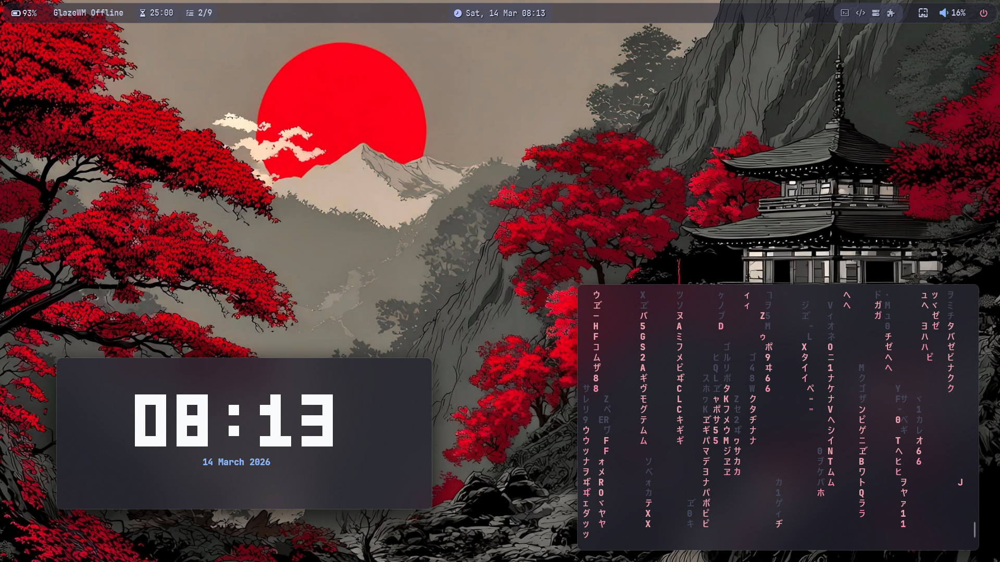 | 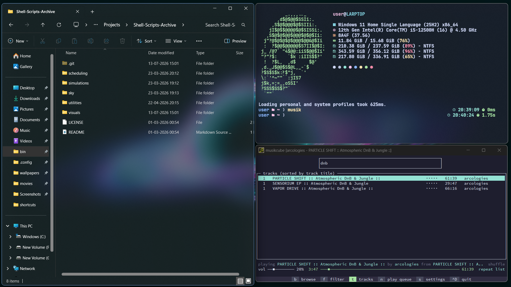 |

A workflow centered around the terminal without sacrificing the convenience of native Windows applications.

---

## Development Environment

| Neovim Dashboard | Terminal File Manager |
|:----------------:|:--------------------:|
| 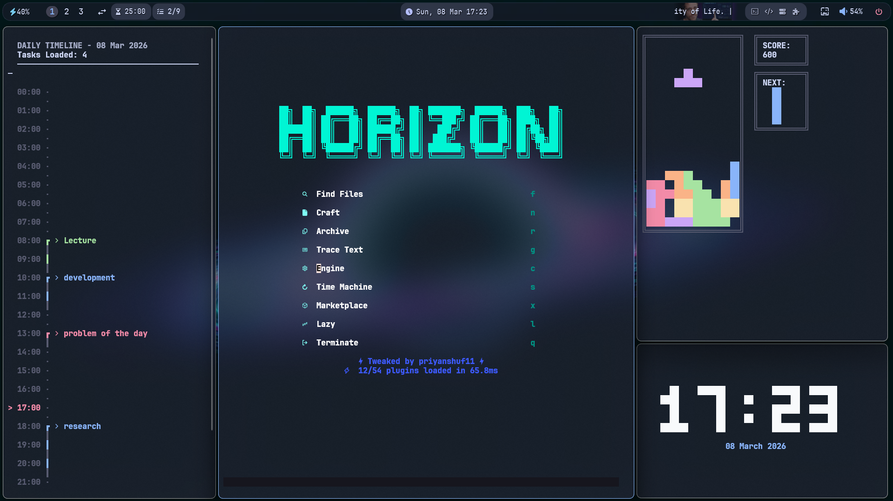 | 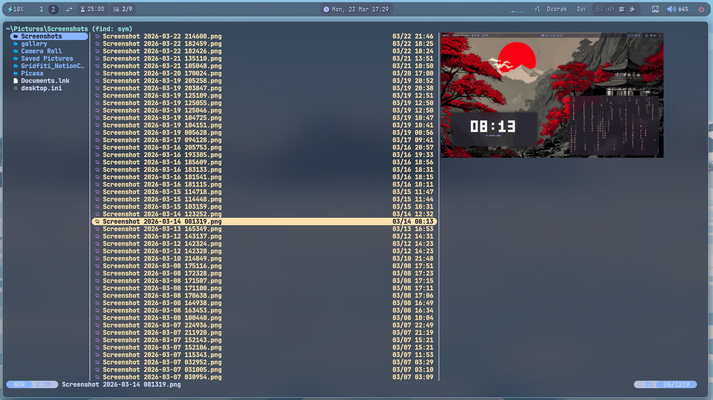 |

Modern terminal tooling for development, navigation, and daily work.

---

## Terminal & Utilities

<p align="center">
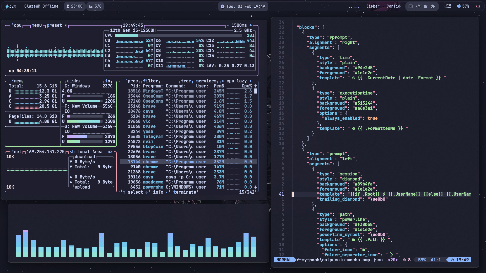
</p>

A collection of custom PowerShell utilities, themed terminal applications, and reusable scripts.

---

## Desktop Widgets

<p align="center">
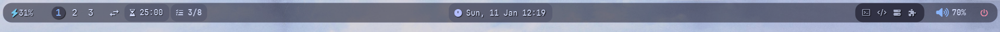
</p>

Widgets designed to stay informative without overwhelming the desktop.

| Calendar | Tasks |
|:--------:|:-----:|
| 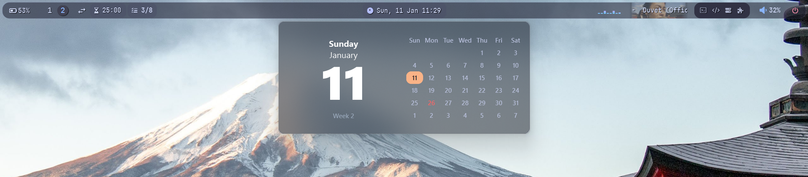 | 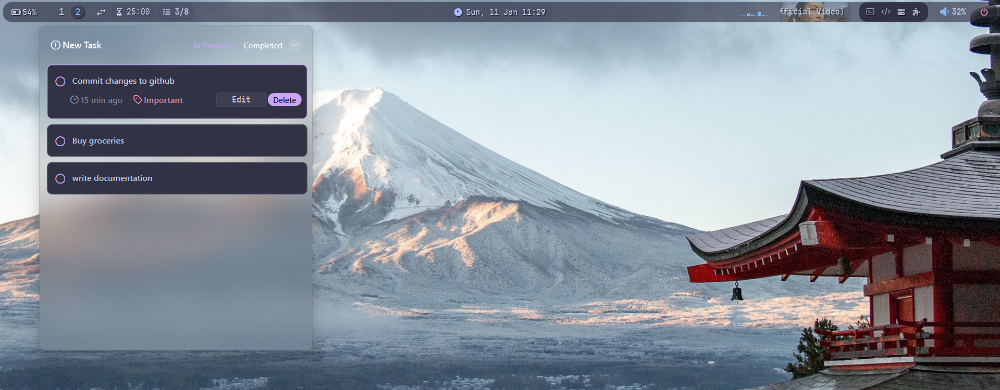 |

| Pomodoro | Power Menu |
|:---------:|:----------:|
| 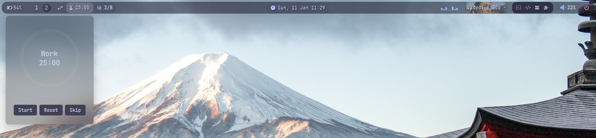 | 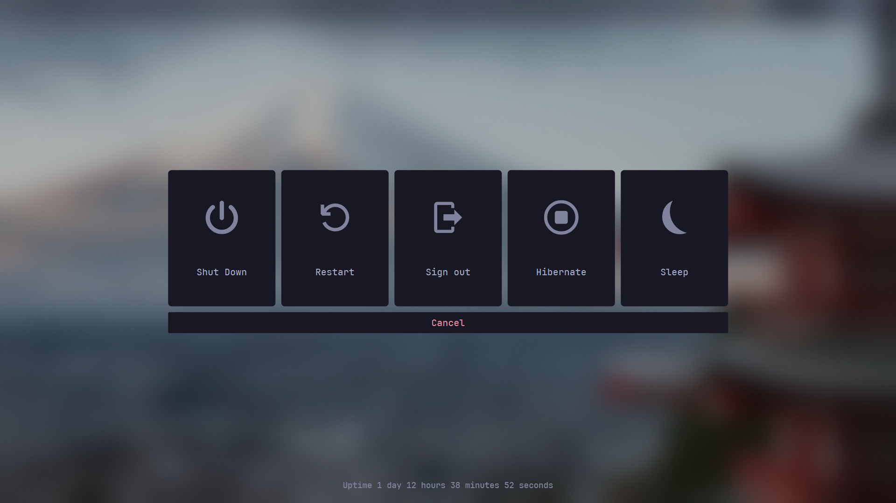 |

---

## Window Management

<p align="center">
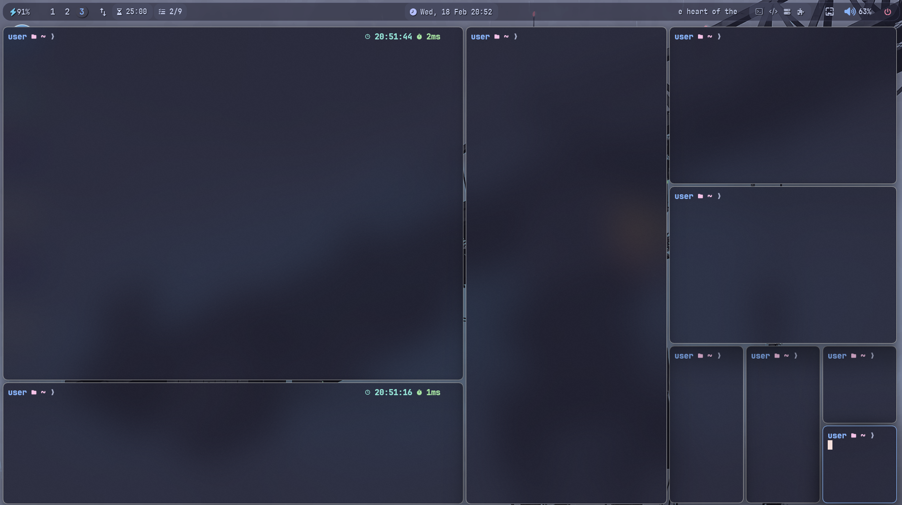
</p>

A workspace built around dynamic tiling, multiple workspaces, and keyboard-driven navigation.

---

## Wallpaper Browser

<p align="center">
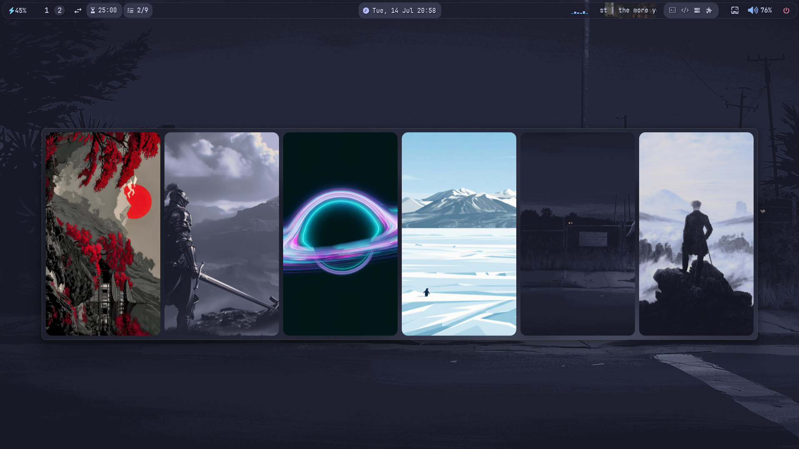
</p>

Quickly browse and switch wallpapers without leaving the desktop.

---

## Command Palette

<p align="center">
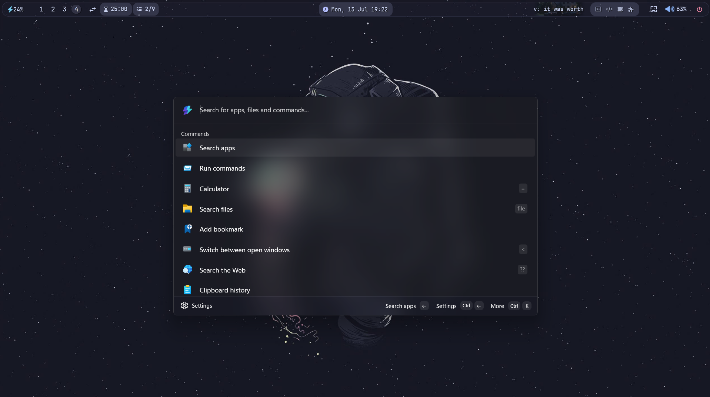
</p>

Fast application launching, command execution, and navigation.

---

# Highlights

- 🎨 Consistent desktop theme across applications
- ⌨️ Keyboard-first workflow
- 🪟 Dynamic tiling window management
- 📊 Lightweight desktop widgets
- ⚡ Custom PowerShell utilities
- 🖥️ Terminal-focused development environment
- 📁 Modular configuration files
- 🧩 Easily mix and match individual components

---

# Repository Structure

```text
.
├── assets/
│   ├── media/
│   └── screenshots/
│
├── fastfetch/
├── glazewm/
├── oh-my-posh/
├── wallpapers/
├── scheduling/
├── simulations/
├── sky/
├── utilities/
├── visuals/
├── yasb/
└── ...
```

---

# Philosophy

This repository isn't intended to be a one-click desktop setup.

It's a collection of the configurations, scripts, utilities, and experiments I've built over time to make Windows a workspace that feels both productive and enjoyable to use.

Every directory can be explored independently. Feel free to borrow individual ideas, adapt them to your own setup, or simply use them as inspiration.

---

# Installation

Clone the repository.

```bash
git clone https://github.com/<username>/windows-customization-dotfiles.git
```

Browse the folders and copy whichever configurations or scripts you'd like to use.

Most components are independent and can be installed separately.

---

# Credits

This repository builds upon many excellent open-source projects and communities.

Some of the tools used throughout this setup include:

- YASB
- GlazeWM
- Fastfetch
- LazyVim
- Yazi
- Oh My Posh
- Flow Launcher
- musikcube

A huge thank you to everyone who contributes to these projects.

---

# License

This repository is released under the MIT License.

If you find something useful, feel free to use it, modify it, or build upon it.
